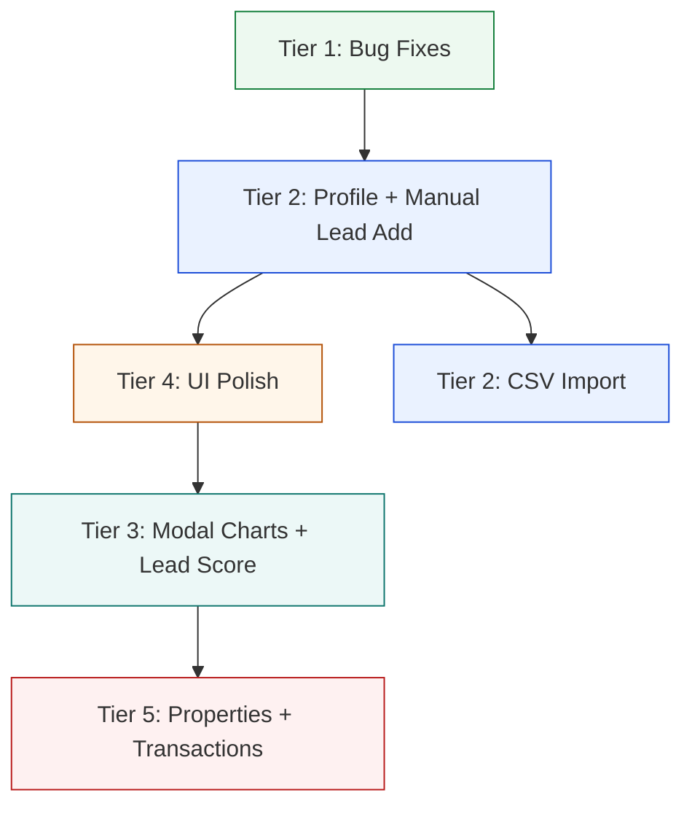

# CRM Improvement Plan — Finalized

After a full code review and browser walkthrough, here is the finalized plan for every item on your CRM to-do list. Items are grouped into priority tiers. All open decisions have been resolved.

---

## Current Architecture Summary

The entire CRM UI lives in a **single component**: [crm-workspace.tsx](file:///c:/Users/19143/Projects/real-estate-platform/apps/crm/app/components/crm-workspace.tsx) (3,228 lines), with styling in [globals.css](file:///c:/Users/19143/Projects/real-estate-platform/apps/crm/app/globals.css) (1,721 lines). Navigation state is managed via `WorkspaceNav` & `WorkspaceView` types in [workspace-interactions.ts](file:///c:/Users/19143/Projects/real-estate-platform/apps/crm/app/lib/workspace-interactions.ts).

Views: **Dashboard**, **Pipeline Board**, **Leads Table**, and **Settings** — all rendered inline by the single component. The lead detail modal also renders inline.

> [!IMPORTANT]
> Before starting execution, I recommend we **first decompose the monolithic component** into smaller files (sidebar, header, dashboard, pipeline, leads-table, settings, lead-modal) so that the remaining changes are cleaner and easier to manage. This refactoring is not listed in your todo but would significantly de-risk everything else.

---

## Tier 1 — Quick Bug Fixes ✅ COMPLETE

### 1. Sidebar Active State Visibility Bug

**Root cause identified**: The `.crm-side-nav-item.is-active` class sets `background: var(--crm-highlight-soft)` and `color: var(--crm-accent)`. The `--crm-highlight-soft` is defined as `withHexAlpha(accent, 0.11)`, which means it's essentially an 11% opacity version of the accent color. When the accent is the default dark brown (`#1c1917`), the highlight background is nearly invisible, and the text color matches `--crm-accent` (also `#1c1917`) — making the active item **blend into the surface** and appear blank.

**Fix**: Use a more visible background for the active state — either use `--crm-bg-soft` with a left-border accent indicator, or increase the opacity on `--crm-highlight-soft` to something like 0.20+ and ensure the text stays dark/contrasted.

#### [MODIFY] [globals.css](file:///c:/Users/19143/Projects/real-estate-platform/apps/crm/app/globals.css)
- Update `.crm-side-nav-item.is-active` to use a higher contrast background and potentially a left-border accent bar

#### [MODIFY] [crm-workspace.tsx](file:///c:/Users/19143/Projects/real-estate-platform/apps/crm/app/components/crm-workspace.tsx)
- Update `buildBrandThemeVars()` to generate a more visible `--crm-highlight-soft` value (increase alpha from 0.11 to ~0.18–0.22)

---

### 2. Profile Link → Dashboard Redirect

**Root cause identified**: The "Profile" button in the avatar dropdown (line ~1884) calls `openDashboard()` instead of navigating to a profile view. There is no `'profile'` view type.

**Fix**: We'll fix this in Tier 2 when building the Profile page. For now, the behavior is intentional (no profile page exists yet).

---

### 3. Settings Custom Colors Not Working

**Root cause identified**: The Settings page correctly updates `brandPreferences` state and persists to `localStorage`. The `buildBrandThemeVars()` function generates CSS custom properties, which are applied via `style={brandThemeVars}` on the root container div. **However**, many CSS rules throughout `globals.css` use **hardcoded values** instead of the CSS variables — for example, button backgrounds, the sidebar, header, and footer all reference `var(--crm-accent)` which IS in the inline style, so those should work.

After browser testing, the issue appears to be that the `type="color"` input **does update state and re-render**, but the visual effect is subtle because the default accent (`#1c1917`) only controls a few surfaces. The color picker may also not properly trigger in some browser configurations.

**Fix**: 
- Audit all CSS rules and ensure they reference `var(--crm-accent)` and `var(--crm-brand-tint)` rather than hardcoded values
- Add a visible "Changes saved" feedback toast when colors are modified
- Ensure the brand preview updates in real-time with a more obvious visual sample (show colored buttons, badges, etc.)

#### [MODIFY] [globals.css](file:///c:/Users/19143/Projects/real-estate-platform/apps/crm/app/globals.css)
- Audit and replace any remaining hardcoded color values with CSS variable references

#### [MODIFY] [crm-workspace.tsx](file:///c:/Users/19143/Projects/real-estate-platform/apps/crm/app/components/crm-workspace.tsx)
- Add save confirmation toast to Settings
- Enhance brand preview with more surfaces (button samples, badge samples)

---

### 4. Status Icons Replacement

**Current**: Unicode glyphs — `•` (New), `◆` (Qualified), `◌` (Nurturing), `▲` (Won), `✕` (Lost) — in [getStatusGlyph()](file:///c:/Users/19143/Projects/real-estate-platform/apps/crm/app/components/crm-workspace.tsx#L171-L186).

✅ **Decision: Professional inline SVG icons** (HubSpot/Salesforce style). Each status gets a small, clean SVG icon with its matching status color.

| Status | Current | New SVG Icon | Color |
|---------|---------|-------------|-------|
| New | `•` | Sparkle/star SVG | `--status-new` blue |
| Qualified | `◆` | Checkmark-circle SVG | `--status-qualified` purple |
| Nurturing | `◌` | Chat-bubble SVG | `--status-nurturing` amber |
| Won | `▲` | Trophy SVG | `--status-won` green |
| Lost | `✕` | Archive/pause SVG | `--status-lost` neutral |

#### [MODIFY] [crm-workspace.tsx](file:///c:/Users/19143/Projects/real-estate-platform/apps/crm/app/components/crm-workspace.tsx)
- Replace `getStatusGlyph()` with `StatusIcon` component returning inline SVGs
- Used in: dashboard status pills (line ~1962), pipeline column headers (line ~2621)

---

### 5. Leads Table — Freeze Header Row & Rename

**Current state**: The CSS already has `position: sticky; top: 0` on `.crm-leads-table th` (line ~1482 in globals.css). **However**, the parent `.crm-leads-table-panel` has `overflow: hidden` (line ~1458) and `.crm-table-wrap` has `overflow-x: auto`, which breaks the sticky behavior.

**Fix**: 
- Set a `max-height` on `.crm-table-wrap` to enable vertical scrolling within the table panel
- Keep `overflow-x: auto` for horizontal scroll of the wide table
- Add `overflow-y: auto` to enable vertical scroll with sticky header

✅ **Decision: Rename to "Lead Tracker"** — professional yet energetic. All references to "Leads Table" will be updated, and "Lead Command Center" will be replaced with a warmer CRM title.

#### [MODIFY] [globals.css](file:///c:/Users/19143/Projects/real-estate-platform/apps/crm/app/globals.css)
- Update `.crm-table-wrap` to add `max-height` and `overflow-y: auto`

#### [MODIFY] [crm-workspace.tsx](file:///c:/Users/19143/Projects/real-estate-platform/apps/crm/app/components/crm-workspace.tsx)
- Rename all references to "Leads Table" → "Lead Tracker" (header, nav item, footer links)
- Update "Lead Command Center" to a warmer CRM title

---

## Tier 2 — New Pages & Core Features (2–4 hours each)

### 6. Profile Page

**Current**: Clicking "Profile" in the avatar dropdown calls `openDashboard()`. No profile view exists.

**Proposed**: Add a new `'profile'` view type and build a Profile page with:
- **Agent headshot** (uploadable image URL, stored in brand preferences or a profile settings object)
- Agent name, brokerage, license #, phone, email
- Display the headshot in the header avatar area (instead of initials)
- Agent bio/tagline
- Quick stats (total leads, win rate, active pipeline)

#### [MODIFY] [workspace-interactions.ts](file:///c:/Users/19143/Projects/real-estate-platform/apps/crm/app/lib/workspace-interactions.ts)
- Add `'profile'` to `WorkspaceNav` and `WorkspaceView` types

#### [MODIFY] [crm-workspace.tsx](file:///c:/Users/19143/Projects/real-estate-platform/apps/crm/app/components/crm-workspace.tsx)
- Add `AgentProfile` interface to `BrandPreferences` (or separate state)
- Build `activeView === 'profile'` section with headshot, bio, stats
- Update avatar button to show headshot image when available
- Wire "Profile" button in avatar menu to navigate to `'profile'` view

#### [MODIFY] [globals.css](file:///c:/Users/19143/Projects/real-estate-platform/apps/crm/app/globals.css)
- Add `.crm-profile-*` styles for the profile page layout

---

### 7. Manual Lead Creation

**Current**: There's a "New Contact" form in the dashboard sidebar but **no way to create a lead manually**. Leads only come through ingestion.

**Proposed**: Add a "New Lead" form, either:
- **(A)** In the sidebar alongside "New Contact", or
- **(B)** As a button at the top of the Leads Table / Dashboard that opens a creation modal

The form should capture: Contact info (name, email, phone), listing address, property type, lead type (buyer/seller/investor), beds/baths/sqft, notes, and initial status.

#### [MODIFY] [crm-workspace.tsx](file:///c:/Users/19143/Projects/real-estate-platform/apps/crm/app/components/crm-workspace.tsx)
- Add `NewLeadDraft` state and form UI
- Wire to a `POST /api/leads` endpoint

#### [NEW] POST handler in [route.ts](file:///c:/Users/19143/Projects/real-estate-platform/apps/crm/app/api/leads/route.ts)
- Add `POST` export to create a new lead (currently only has `GET`)

#### [MODIFY] DB layer in `@real-estate/db/crm`
- Add a `createLead` function if not present

---

### 8. Lead Import (CSV & CRM)

**Proposed**: Two import methods:
1. **CSV Upload** — Drag & drop or file picker; parse CSV, map columns to lead fields, preview, and import
2. **CRM Import** — API connectors for popular CRMs (Zillow Premier Agent, Realtor.com, BoomTown, Follow Up Boss, kvCORE). Start with CSV and one or two API connectors.

> [!WARNING]
> CRM API integrations each require their own API keys, auth flows, and field mappings. I recommend we **start with CSV import only** in the initial implementation and add CRM connectors as a follow-up phase. This keeps the scope manageable.

#### [NEW] CSV import UI component
- File upload area with drag-and-drop
- Column mapping step (match CSV columns to lead fields)
- Preview step showing mapped data
- Confirm and import

#### [NEW] `POST /api/leads/import` API route
- Accept bulk lead creation from parsed CSV data

---

## Tier 3 — Lead Modal Enhancements (3–5 hours each)

### 9. Lead Modal — Visual Aids (Charts/Graphs)

**Current right panel**: The "Website Behavior Intelligence" section shows four plain text cards (Searches, Listing Views, Favorites, Unfavorites) with counts and a signal list.

**Recommended visual additions for the top-right area**:

1. **Lead Activity Timeline Chart** — A small area/bar chart showing the lead's activity over time (last 30 days). X-axis = days, Y-axis = number of events. This is highly informative and immediately shows engagement patterns.

2. **Lead Engagement Score Gauge** — A radial/donut gauge showing a 0–100 score based on: recency of activity, frequency, favorites-to-views ratio, and search specificity. This ties into #11 (Lead Scoring).

3. **Price Interest Range** — A horizontal range bar showing min–max price from viewed listings, with the lead's most-viewed price highlighted.

**Implementation**: Use inline SVG for charts (no external charting library needed — the KPI sparkline pattern already exists). Alternatively, we could add a lightweight charting lib like `recharts` or build SVGs inline.

#### [MODIFY] [crm-workspace.tsx](file:///c:/Users/19143/Projects/real-estate-platform/apps/crm/app/components/crm-workspace.tsx)
- Add `LeadActivityChart` component (SVG bar/area chart of activity by day)
- Add `LeadEngagementGauge` component (SVG radial gauge, 0–100)
- Add `PriceInterestBar` component (horizontal range indicator)
- Place these in the modal's right-side section

#### [MODIFY] [globals.css](file:///c:/Users/19143/Projects/real-estate-platform/apps/crm/app/globals.css)
- Add styles for chart containers and responsive layout

---

### 10. Suggested Properties Section

**Proposed**: In the lead modal, add a "Suggested Properties" section below the behavior section. Logic:
- Analyze the lead's search queries, viewed listings, favorited listings
- Extract common criteria (price range, beds/baths, location, property type)
- Query the property database for matching listings the lead **hasn't** seen yet
- Display 3–5 property cards with thumbnail, price, address, beds/baths/sqft

> [!IMPORTANT]
> This requires either (a) querying your existing MLS/property database from the CRM, or (b) using cached listing data. If the portal's `home-search` API already supports filtered property queries, we can proxy those from the CRM.

#### [NEW] `GET /api/leads/[leadId]/suggestions` API route
- Analyze lead's behavior data and return matching properties

#### [MODIFY] [crm-workspace.tsx](file:///c:/Users/19143/Projects/real-estate-platform/apps/crm/app/components/crm-workspace.tsx)
- Add `SuggestedProperties` section to lead modal
- Fetch suggestions when modal opens
- Display as small property cards (address, price, specs, link to listing)

---

### 11. Lead Scoring

**Proposed**: Calculate a 0–100 engagement score per lead based on:

| Factor | Weight | Signal |
|--------|--------|--------|
| Recency | 25% | Days since last activity (more recent = higher) |
| Frequency | 25% | Total activities in last 30 days |
| Intent | 30% | Favorites vs views ratio, search specificity |
| Profile completeness | 20% | Has contact info, address, property preferences |

This would be calculated client-side from existing activity data (searches, views, favorites) and displayed as the gauge in #9. It could also appear in the Leads Table as a sortable "Score" column.

#### [MODIFY] [crm-workspace.tsx](file:///c:/Users/19143/Projects/real-estate-platform/apps/crm/app/components/crm-workspace.tsx)
- Add `calculateLeadScore()` function
- Add score column to leads table
- Display score in lead modal via the engagement gauge

---

## Tier 4 — UI Polish & Warmth (2–3 hours)

### 12. UI Cleanup — Warmth, Logos, Names, Titles

**Proposed changes for a warmer, friendlier feel**:

- **Color palette**: Shift from cool beige (`#f8f6f2`) toward warmer tones with subtle gold/amber accents
- **Titles**: Replace technical language:
  - "Lead Command Center" → "Welcome Back" or simply the agent name
  - "Pipeline Board" → "Deal Pipeline"  
  - "Leads Table" → "My Leads" or "Lead Tracker"
  - "Operations" (sidebar) → brand name or "CRM"
- **Logos**: The logo system already supports custom URL and website favicon. Ensure it's prominently displayed in sidebar + header
- **Typography**: Consider slightly warmer serif headings (the Cormorant Garamond is already there — it's warm)
- **Micro-animations**: Add subtle hover lift effects to more cards, smooth transitions on view switches
- **Avatar**: When headshot is available (from Profile page), display it instead of initials throughout

#### [MODIFY] [globals.css](file:///c:/Users/19143/Projects/real-estate-platform/apps/crm/app/globals.css)
- Adjust root color variables for warmth
- Add hover/transition polish
- Improve spacing and visual hierarchy

#### [MODIFY] [crm-workspace.tsx](file:///c:/Users/19143/Projects/real-estate-platform/apps/crm/app/components/crm-workspace.tsx)
- Update all title strings and labels
- Update nav item labels

---

### 15. 7-Day Heartbeat — Dashboard Line Graph

**Proposed**: Replace the existing dashboard activity section with a **hoverable SVG line graph** styled like a heart rate monitor. Covers the past 7 days with one data point per day.

**On hover** over any day, a tooltip shows a breakdown of that day's stats:
- New leads created
- Status changes
- Listings viewed
- Searches performed
- Favorites added

**Visual style**: Smooth polyline with a glowing accent stroke and a subtle pulse animation on the most recent data point. The chart should feel alive and dynamic — like a heart rate monitor.

#### [MODIFY] [crm-workspace.tsx](file:///c:/Users/19143/Projects/real-estate-platform/apps/crm/app/components/crm-workspace.tsx)
- Add `SevenDayHeartbeat` SVG line chart component with hover tooltips
- Compute daily aggregated stats from activities data
- Place on the Dashboard view

#### [MODIFY] [globals.css](file:///c:/Users/19143/Projects/real-estate-platform/apps/crm/app/globals.css)
- Add `.crm-heartbeat-*` styles for chart container, tooltip, glow animation

---

### 16. Clickable Behavior Intelligence Cards (Lead Modal)

**Proposed**: Make the 4 stat cards in the lead modal's "Website Behavior Intelligence" section (Searches, Listing Views, Favorites, Unfavorites) **clickable/expandable** to reveal detailed data.

| Card | Expanded Content |
|------|------------------|
| **Searches** | List of search queries with date, filters used, and result count |
| **Listing Views** | List of viewed listings with address, price, beds/baths, and date |
| **Favorites** | List of favorited listings with address, price, and date |
| **Unfavorites** | List of removed favorites with address and date |

Each card toggles an expandable panel below it when clicked, with a subtle open/close animation.

#### [MODIFY] [crm-workspace.tsx](file:///c:/Users/19143/Projects/real-estate-platform/apps/crm/app/components/crm-workspace.tsx)
- Add click handlers and `expandedCard` state to the modal
- Render detail lists using existing `searchSignals` and `listingSignals` data

#### [MODIFY] [globals.css](file:///c:/Users/19143/Projects/real-estate-platform/apps/crm/app/globals.css)
- Add `.crm-behavior-card-expanded` styles with slide-down animation

## Tier 5 — Major New Sections (5–8 hours each)

### 13. Properties Section / Prospecting Tool

✅ **Decision: Build a map-based property search** in the CRM using IDX listing data (currently mock, will integrate with real MLS feed). The CT property ownership data from the separate repo will be integrated in a future phase.

The CRM will get its own map-based property search view, similar to the portal's `home-search` page but tailored for agent prospecting with CRM-specific actions.

#### [NEW] Properties view in CRM
- **Map-based search** with listing markers (using the same map approach as the portal)
- Property filters (location, price, beds/baths, type)
- Listing cards with key details
- "Assign to Lead" or "Send to Client" CRM-specific actions
- Property detail modal (condensed version)

> [!NOTE]
> Future phase: Integrate CT property ownership data from your separate repo for deeper prospecting (off-market properties, owner info, etc.)

---

### 14. Active Transactions Section

✅ **Decision: Full DB-backed solution from the start.** Transactions are core business data that agents need to persist reliably — localStorage would risk data loss and wouldn't support the multi-tenant architecture.

**Each transaction record tracks:**

- **Property**: Address, listing details (imported or linked)
- **Parties**: Buyer, seller, agents, attorneys, lender
- **Deal Status**: Pipeline stages (Under Contract → Inspection → Appraisal → Title → Closing)
- **Key Dates**: Contract date, inspection deadline, appraisal deadline, mortgage commitment, closing date
- **Documents**: Checklist of required documents and their status
- **Financial Summary**: Sale price, commission, estimated proceeds

**Implementation approach**:
1. Add a `'transactions'` nav item and view
2. Create a DB schema for transactions (tenant-scoped, consistent with existing lead/contact tables)
3. Build API routes for CRUD operations
4. Build a transaction board with stage-based pipeline (similar to the existing lead pipeline)
5. Allow importing a property from the Properties view or lead modal

#### [NEW] Transaction data types in `@real-estate/types`
#### [NEW] `GET/POST /api/transactions` API routes
#### [NEW] Transaction DB schema in `@real-estate/db`
#### [MODIFY] [workspace-interactions.ts](file:///c:/Users/19143/Projects/real-estate-platform/apps/crm/app/lib/workspace-interactions.ts) — Add `'transactions'` nav/view types
#### [MODIFY] [crm-workspace.tsx](file:///c:/Users/19143/Projects/real-estate-platform/apps/crm/app/components/crm-workspace.tsx) — Build transactions view UI

---

## Recommended Execution Order

| Order | Items | Est. Time | Dependencies |
|-------|-------|-----------|-------------|
| 1 | Sidebar bug, table header freeze, status icons | ~2 hours | None |
| 2 | Settings color fix, title/label renames | ~2 hours | None |
| 3 | Profile page | ~3 hours | None |
| 4 | Manual lead creation | ~3 hours | POST API route needed |
| 5 | UI warmth & polish pass | ~3 hours | After title/label decisions |
| 6 | Lead modal charts + lead scoring | ~5 hours | Activity data already available |
| 7 | CSV import | ~4 hours | POST bulk import API route |
| 8 | Suggested properties | ~5 hours | Requires property API access |
| 9 | Properties/prospecting view | ~8 hours | Shared backend APIs |
| 10 | Active transactions | ~8 hours | DB schema, new API routes |

---

## Verification Plan

### Automated Tests
- Extend existing [workspace-interactions.test.ts](file:///c:/Users/19143/Projects/real-estate-platform/apps/crm/app/lib/workspace-interactions.test.ts) with new nav/view types
  - Run: `npm run test:workspace` from `apps/crm`
- Add unit tests for `calculateLeadScore()` function
- Add tests for CSV parsing logic
- Run existing route tests: `npm run test:routes` from `apps/crm`

### Browser-Based Verification
For each tier, I will use the browser tool to:
1. Navigate to `http://localhost:3001`
2. Verify the specific changes visually
3. Test interactive elements (click through nav, open modals, submit forms)
4. Screenshot results for the walkthrough

### Manual Verification (User)
After each tier is complete, I'll ask you to review the changes in your browser and provide feedback before moving to the next tier.

---

## Finalized Decisions

All decisions have been confirmed:

| # | Decision | Choice |
|---|----------|--------|
| 1 | Execution order | Approved as proposed |
| 2 | Component refactoring | ✅ Approved — will ensure multi-tenant replication is preserved |
| 3 | Leads Table rename | **"Lead Tracker"** |
| 4 | Status icons | **Professional inline SVGs** |
| 5 | Properties integration | **Map-based search** using IDX listing data (CT ownership data deferred) |
| 6 | Lead modal charts | **All 3**: activity timeline, engagement gauge, price range bar |
| 7 | Transactions | **Full DB-backed** solution (tenant-scoped) |

> [!NOTE]
> **Multi-tenant constraint**: The component refactoring will preserve the architecture where each agent gets their own CRM instance with personal branding/data. All tenant-specific data (agent info, leads, contacts, transactions) is already scoped by `tenantId` — this pattern will be maintained throughout all changes.
