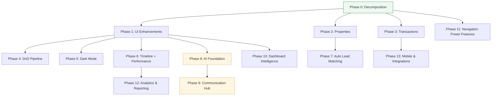

# CRM Improvement Plan — Finalized

After a full code review and browser walkthrough, here is the finalized plan for every item on your CRM to-do list. Items are grouped into priority tiers. All open decisions have been resolved.

---

## Current Architecture Summary

The entire CRM UI lives in a **single component**: [crm-workspace.tsx](file:///c:/Users/19143/Projects/real-estate-platform/apps/crm/app/components/crm-workspace.tsx) (3,228 lines), with styling in [globals.css](file:///c:/Users/19143/Projects/real-estate-platform/apps/crm/app/globals.css) (1,721 lines). Navigation state is managed via `WorkspaceNav` & `WorkspaceView` types in [workspace-interactions.ts](file:///c:/Users/19143/Projects/real-estate-platform/apps/crm/app/lib/workspace-interactions.ts).

Views: **Dashboard**, **Pipeline Board**, **Leads Table**, and **Settings** — all rendered inline by the single component. The lead detail modal also renders inline.

> [!IMPORTANT]
> Before starting execution, I recommend we **first decompose the monolithic component** into smaller files (sidebar, header, dashboard, pipeline, leads-table, settings, lead-modal) so that the remaining changes are cleaner and easier to manage. This refactoring is not listed in your todo but would significantly de-risk everything else.

---

## Tier 1 — Quick Bug Fixes ✅ COMPLETE

### 1. Sidebar Active State Visibility Bug

**Root cause identified**: The `.crm-side-nav-item.is-active` class sets `background: var(--crm-highlight-soft)` and `color: var(--crm-accent)`. The `--crm-highlight-soft` is defined as `withHexAlpha(accent, 0.11)`, which means it's essentially an 11% opacity version of the accent color. When the accent is the default dark brown (`#1c1917`), the highlight background is nearly invisible, and the text color matches `--crm-accent` (also `#1c1917`) — making the active item **blend into the surface** and appear blank.

**Fix**: Use a more visible background for the active state — either use `--crm-bg-soft` with a left-border accent indicator, or increase the opacity on `--crm-highlight-soft` to something like 0.20+ and ensure the text stays dark/contrasted.

#### [MODIFY] [globals.css](file:///c:/Users/19143/Projects/real-estate-platform/apps/crm/app/globals.css)
- Update `.crm-side-nav-item.is-active` to use a higher contrast background and potentially a left-border accent bar

#### [MODIFY] [crm-workspace.tsx](file:///c:/Users/19143/Projects/real-estate-platform/apps/crm/app/components/crm-workspace.tsx)
- Update `buildBrandThemeVars()` to generate a more visible `--crm-highlight-soft` value (increase alpha from 0.11 to ~0.18–0.22)

---

### 2. Profile Link → Dashboard Redirect

**Root cause identified**: The "Profile" button in the avatar dropdown (line ~1884) calls `openDashboard()` instead of navigating to a profile view. There is no `'profile'` view type.

**Fix**: We'll fix this in Tier 2 when building the Profile page. For now, the behavior is intentional (no profile page exists yet).

---

### 3. Settings Custom Colors Not Working

**Root cause identified**: The Settings page correctly updates `brandPreferences` state and persists to `localStorage`. The `buildBrandThemeVars()` function generates CSS custom properties, which are applied via `style={brandThemeVars}` on the root container div. **However**, many CSS rules throughout `globals.css` use **hardcoded values** instead of the CSS variables — for example, button backgrounds, the sidebar, header, and footer all reference `var(--crm-accent)` which IS in the inline style, so those should work.

After browser testing, the issue appears to be that the `type="color"` input **does update state and re-render**, but the visual effect is subtle because the default accent (`#1c1917`) only controls a few surfaces. The color picker may also not properly trigger in some browser configurations.

**Fix**: 
- Audit all CSS rules and ensure they reference `var(--crm-accent)` and `var(--crm-brand-tint)` rather than hardcoded values
- Add a visible "Changes saved" feedback toast when colors are modified
- Ensure the brand preview updates in real-time with a more obvious visual sample (show colored buttons, badges, etc.)

#### [MODIFY] [globals.css](file:///c:/Users/19143/Projects/real-estate-platform/apps/crm/app/globals.css)
- Audit and replace any remaining hardcoded color values with CSS variable references

#### [MODIFY] [crm-workspace.tsx](file:///c:/Users/19143/Projects/real-estate-platform/apps/crm/app/components/crm-workspace.tsx)
- Add save confirmation toast to Settings
- Enhance brand preview with more surfaces (button samples, badge samples)

---

### 4. Status Icons Replacement

**Current**: Unicode glyphs — `•` (New), `◆` (Qualified), `◌` (Nurturing), `▲` (Won), `✕` (Lost) — in [getStatusGlyph()](file:///c:/Users/19143/Projects/real-estate-platform/apps/crm/app/components/crm-workspace.tsx#L171-L186).

✅ **Decision: Professional inline SVG icons** (HubSpot/Salesforce style). Each status gets a small, clean SVG icon with its matching status color.

| Status | Current | New SVG Icon | Color |
|---------|---------|-------------|-------|
| New | `•` | Sparkle/star SVG | `--status-new` blue |
| Qualified | `◆` | Checkmark-circle SVG | `--status-qualified` purple |
| Nurturing | `◌` | Chat-bubble SVG | `--status-nurturing` amber |
| Won | `▲` | Trophy SVG | `--status-won` green |
| Lost | `✕` | Archive/pause SVG | `--status-lost` neutral |

#### [MODIFY] [crm-workspace.tsx](file:///c:/Users/19143/Projects/real-estate-platform/apps/crm/app/components/crm-workspace.tsx)
- Replace `getStatusGlyph()` with `StatusIcon` component returning inline SVGs
- Used in: dashboard status pills (line ~1962), pipeline column headers (line ~2621)

---

### 5. Leads Table — Freeze Header Row & Rename

**Current state**: The CSS already has `position: sticky; top: 0` on `.crm-leads-table th` (line ~1482 in globals.css). **However**, the parent `.crm-leads-table-panel` has `overflow: hidden` (line ~1458) and `.crm-table-wrap` has `overflow-x: auto`, which breaks the sticky behavior.

**Fix**: 
- Set a `max-height` on `.crm-table-wrap` to enable vertical scrolling within the table panel
- Keep `overflow-x: auto` for horizontal scroll of the wide table
- Add `overflow-y: auto` to enable vertical scroll with sticky header

✅ **Decision: Rename to "Lead Tracker"** — professional yet energetic. All references to "Leads Table" will be updated, and "Lead Command Center" will be replaced with a warmer CRM title.

#### [MODIFY] [globals.css](file:///c:/Users/19143/Projects/real-estate-platform/apps/crm/app/globals.css)
- Update `.crm-table-wrap` to add `max-height` and `overflow-y: auto`

#### [MODIFY] [crm-workspace.tsx](file:///c:/Users/19143/Projects/real-estate-platform/apps/crm/app/components/crm-workspace.tsx)
- Rename all references to "Leads Table" → "Lead Tracker" (header, nav item, footer links)
- Update "Lead Command Center" to a warmer CRM title

---

## Tier 2 — New Pages & Core Features (2–4 hours each)

### 6. Profile Page

**Current**: Clicking "Profile" in the avatar dropdown calls `openDashboard()`. No profile view exists.

**Proposed**: Add a new `'profile'` view type and build a Profile page with:
- **Agent headshot** (uploadable image URL, stored in brand preferences or a profile settings object)
- Agent name, brokerage, license #, phone, email
- Display the headshot in the header avatar area (instead of initials)
- Agent bio/tagline
- Quick stats (total leads, win rate, active pipeline)

#### [MODIFY] [workspace-interactions.ts](file:///c:/Users/19143/Projects/real-estate-platform/apps/crm/app/lib/workspace-interactions.ts)
- Add `'profile'` to `WorkspaceNav` and `WorkspaceView` types

#### [MODIFY] [crm-workspace.tsx](file:///c:/Users/19143/Projects/real-estate-platform/apps/crm/app/components/crm-workspace.tsx)
- Add `AgentProfile` interface to `BrandPreferences` (or separate state)
- Build `activeView === 'profile'` section with headshot, bio, stats
- Update avatar button to show headshot image when available
- Wire "Profile" button in avatar menu to navigate to `'profile'` view

#### [MODIFY] [globals.css](file:///c:/Users/19143/Projects/real-estate-platform/apps/crm/app/globals.css)
- Add `.crm-profile-*` styles for the profile page layout

---

### 7. Manual Lead Creation

**Current**: There's a "New Contact" form in the dashboard sidebar but **no way to create a lead manually**. Leads only come through ingestion.

**Proposed**: Add a "New Lead" form, either:
- **(A)** In the sidebar alongside "New Contact", or
- **(B)** As a button at the top of the Leads Table / Dashboard that opens a creation modal

The form should capture: Contact info (name, email, phone), listing address, property type, lead type (buyer/seller/investor), beds/baths/sqft, notes, and initial status.

#### [MODIFY] [crm-workspace.tsx](file:///c:/Users/19143/Projects/real-estate-platform/apps/crm/app/components/crm-workspace.tsx)
- Add `NewLeadDraft` state and form UI
- Wire to a `POST /api/leads` endpoint

#### [NEW] POST handler in [route.ts](file:///c:/Users/19143/Projects/real-estate-platform/apps/crm/app/api/leads/route.ts)
- Add `POST` export to create a new lead (currently only has `GET`)

#### [MODIFY] DB layer in `@real-estate/db/crm`
- Add a `createLead` function if not present

---

### 8. Lead Import (CSV & CRM)

**Proposed**: Two import methods:
1. **CSV Upload** — Drag & drop or file picker; parse CSV, map columns to lead fields, preview, and import
2. **CRM Import** — API connectors for popular CRMs (Zillow Premier Agent, Realtor.com, BoomTown, Follow Up Boss, kvCORE). Start with CSV and one or two API connectors.

> [!WARNING]
> CRM API integrations each require their own API keys, auth flows, and field mappings. I recommend we **start with CSV import only** in the initial implementation and add CRM connectors as a follow-up phase. This keeps the scope manageable.

#### [NEW] CSV import UI component
- File upload area with drag-and-drop
- Column mapping step (match CSV columns to lead fields)
- Preview step showing mapped data
- Confirm and import

#### [NEW] `POST /api/leads/import` API route
- Accept bulk lead creation from parsed CSV data

---

## Tier 3 — Lead Modal Enhancements (3–5 hours each)

### 9. Lead Modal — Visual Aids (Charts/Graphs)

**Current right panel**: The "Website Behavior Intelligence" section shows four plain text cards (Searches, Listing Views, Favorites, Unfavorites) with counts and a signal list.

**Recommended visual additions for the top-right area**:

1. **Lead Activity Timeline Chart** — A small area/bar chart showing the lead's activity over time (last 30 days). X-axis = days, Y-axis = number of events. This is highly informative and immediately shows engagement patterns.

2. **Lead Engagement Score Gauge** — A radial/donut gauge showing a 0–100 score based on: recency of activity, frequency, favorites-to-views ratio, and search specificity. This ties into #11 (Lead Scoring).

3. **Price Interest Range** — A horizontal range bar showing min–max price from viewed listings, with the lead's most-viewed price highlighted.

**Implementation**: Use inline SVG for charts (no external charting library needed — the KPI sparkline pattern already exists). Alternatively, we could add a lightweight charting lib like `recharts` or build SVGs inline.

#### [MODIFY] [crm-workspace.tsx](file:///c:/Users/19143/Projects/real-estate-platform/apps/crm/app/components/crm-workspace.tsx)
- Add `LeadActivityChart` component (SVG bar/area chart of activity by day)
- Add `LeadEngagementGauge` component (SVG radial gauge, 0–100)
- Add `PriceInterestBar` component (horizontal range indicator)
- Place these in the modal's right-side section

#### [MODIFY] [globals.css](file:///c:/Users/19143/Projects/real-estate-platform/apps/crm/app/globals.css)
- Add styles for chart containers and responsive layout

---

### 10. Suggested Properties Section

**Proposed**: In the lead modal, add a "Suggested Properties" section below the behavior section. Logic:
- Analyze the lead's search queries, viewed listings, favorited listings
- Extract common criteria (price range, beds/baths, location, property type)
- Query the property database for matching listings the lead **hasn't** seen yet
- Display 3–5 property cards with thumbnail, price, address, beds/baths/sqft

> [!IMPORTANT]
> This requires either (a) querying your existing MLS/property database from the CRM, or (b) using cached listing data. If the portal's `home-search` API already supports filtered property queries, we can proxy those from the CRM.

#### [NEW] `GET /api/leads/[leadId]/suggestions` API route
- Analyze lead's behavior data and return matching properties

#### [MODIFY] [crm-workspace.tsx](file:///c:/Users/19143/Projects/real-estate-platform/apps/crm/app/components/crm-workspace.tsx)
- Add `SuggestedProperties` section to lead modal
- Fetch suggestions when modal opens
- Display as small property cards (address, price, specs, link to listing)

---

### 11. Lead Scoring

**Proposed**: Calculate a 0–100 engagement score per lead based on:

| Factor | Weight | Signal |
|--------|--------|--------|
| Recency | 25% | Days since last activity (more recent = higher) |
| Frequency | 25% | Total activities in last 30 days |
| Intent | 30% | Favorites vs views ratio, search specificity |
| Profile completeness | 20% | Has contact info, address, property preferences |

This would be calculated client-side from existing activity data (searches, views, favorites) and displayed as the gauge in #9. It could also appear in the Leads Table as a sortable "Score" column.

#### [MODIFY] [crm-workspace.tsx](file:///c:/Users/19143/Projects/real-estate-platform/apps/crm/app/components/crm-workspace.tsx)
- Add `calculateLeadScore()` function
- Add score column to leads table
- Display score in lead modal via the engagement gauge

---

## Tier 4 — UI Polish & Warmth (2–3 hours)

### 12. UI Cleanup — Warmth, Logos, Names, Titles

**Proposed changes for a warmer, friendlier feel**:

- **Color palette**: Shift from cool beige (`#f8f6f2`) toward warmer tones with subtle gold/amber accents
- **Titles**: Replace technical language:
  - "Lead Command Center" → "Welcome Back" or simply the agent name
  - "Pipeline Board" → "Deal Pipeline"  
  - "Leads Table" → "My Leads" or "Lead Tracker"
  - "Operations" (sidebar) → brand name or "CRM"
- **Logos**: The logo system already supports custom URL and website favicon. Ensure it's prominently displayed in sidebar + header
- **Typography**: Consider slightly warmer serif headings (the Cormorant Garamond is already there — it's warm)
- **Micro-animations**: Add subtle hover lift effects to more cards, smooth transitions on view switches
- **Avatar**: When headshot is available (from Profile page), display it instead of initials throughout

#### [MODIFY] [globals.css](file:///c:/Users/19143/Projects/real-estate-platform/apps/crm/app/globals.css)
- Adjust root color variables for warmth
- Add hover/transition polish
- Improve spacing and visual hierarchy

#### [MODIFY] [crm-workspace.tsx](file:///c:/Users/19143/Projects/real-estate-platform/apps/crm/app/components/crm-workspace.tsx)
- Update all title strings and labels
- Update nav item labels

---

### 15. 7-Day Heartbeat — Dashboard Line Graph

**Proposed**: Replace the existing dashboard activity section with a **hoverable SVG line graph** styled like a heart rate monitor. Covers the past 7 days with one data point per day.

**On hover** over any day, a tooltip shows a breakdown of that day's stats:
- New leads created
- Status changes
- Listings viewed
- Searches performed
- Favorites added

**Visual style**: Smooth polyline with a glowing accent stroke and a subtle pulse animation on the most recent data point. The chart should feel alive and dynamic — like a heart rate monitor.

#### [MODIFY] [crm-workspace.tsx](file:///c:/Users/19143/Projects/real-estate-platform/apps/crm/app/components/crm-workspace.tsx)
- Add `SevenDayHeartbeat` SVG line chart component with hover tooltips
- Compute daily aggregated stats from activities data
- Place on the Dashboard view

#### [MODIFY] [globals.css](file:///c:/Users/19143/Projects/real-estate-platform/apps/crm/app/globals.css)
- Add `.crm-heartbeat-*` styles for chart container, tooltip, glow animation

---

### 16. Clickable Behavior Intelligence Cards (Lead Modal)

**Proposed**: Make the 4 stat cards in the lead modal's "Website Behavior Intelligence" section (Searches, Listing Views, Favorites, Unfavorites) **clickable/expandable** to reveal detailed data.

| Card | Expanded Content |
|------|------------------|
| **Searches** | List of search queries with date, filters used, and result count |
| **Listing Views** | List of viewed listings with address, price, beds/baths, and date |
| **Favorites** | List of favorited listings with address, price, and date |
| **Unfavorites** | List of removed favorites with address and date |

Each card toggles an expandable panel below it when clicked, with a subtle open/close animation.

#### [MODIFY] [crm-workspace.tsx](file:///c:/Users/19143/Projects/real-estate-platform/apps/crm/app/components/crm-workspace.tsx)
- Add click handlers and `expandedCard` state to the modal
- Render detail lists using existing `searchSignals` and `listingSignals` data

#### [MODIFY] [globals.css](file:///c:/Users/19143/Projects/real-estate-platform/apps/crm/app/globals.css)
- Add `.crm-behavior-card-expanded` styles with slide-down animation

## Tier 5 — Major New Sections (5–8 hours each)

### 13. Properties Section / Prospecting Tool

✅ **Decision: Build a map-based property search** in the CRM using IDX listing data (currently mock, will integrate with real MLS feed). The CT property ownership data from the separate repo will be integrated in a future phase.

The CRM will get its own map-based property search view, similar to the portal's `home-search` page but tailored for agent prospecting with CRM-specific actions.

#### [NEW] Properties view in CRM
- **Map-based search** with listing markers (using the same map approach as the portal)
- Property filters (location, price, beds/baths, type)
- Listing cards with key details
- "Assign to Lead" or "Send to Client" CRM-specific actions
- Property detail modal (condensed version)

> [!NOTE]
> Future phase: Integrate CT property ownership data from your separate repo for deeper prospecting (off-market properties, owner info, etc.)

---

### 14. Active Transactions Section

✅ **Decision: Full DB-backed solution from the start.** Transactions are core business data that agents need to persist reliably — localStorage would risk data loss and wouldn't support the multi-tenant architecture.

**Each transaction record tracks:**

- **Property**: Address, listing details (imported or linked)
- **Parties**: Buyer, seller, agents, attorneys, lender
- **Deal Status**: Pipeline stages (Under Contract → Inspection → Appraisal → Title → Closing)
- **Key Dates**: Contract date, inspection deadline, appraisal deadline, mortgage commitment, closing date
- **Documents**: Checklist of required documents and their status
- **Financial Summary**: Sale price, commission, estimated proceeds

**Implementation approach**:
1. Add a `'transactions'` nav item and view
2. Create a DB schema for transactions (tenant-scoped, consistent with existing lead/contact tables)
3. Build API routes for CRUD operations
4. Build a transaction board with stage-based pipeline (similar to the existing lead pipeline)
5. Allow importing a property from the Properties view or lead modal

#### [NEW] Transaction data types in `@real-estate/types`
#### [NEW] `GET/POST /api/transactions` API routes
#### [NEW] Transaction DB schema in `@real-estate/db`
#### [MODIFY] [workspace-interactions.ts](file:///c:/Users/19143/Projects/real-estate-platform/apps/crm/app/lib/workspace-interactions.ts) — Add `'transactions'` nav/view types
#### [MODIFY] [crm-workspace.tsx](file:///c:/Users/19143/Projects/real-estate-platform/apps/crm/app/components/crm-workspace.tsx) — Build transactions view UI

---

## Recommended Execution Order


| Order | Items | Est. Time | Dependencies |
|-------|-------|-----------|-------------|
| 1 | Sidebar bug, table header freeze, status icons | ~2 hours | None |
| 2 | Settings color fix, title/label renames | ~2 hours | None |
| 3 | Profile page | ~3 hours | None |
| 4 | Manual lead creation | ~3 hours | POST API route needed |
| 5 | UI warmth & polish pass | ~3 hours | After title/label decisions |
| 6 | Lead modal charts + lead scoring | ~5 hours | Activity data already available |
| 7 | CSV import | ~4 hours | POST bulk import API route |
| 8 | Suggested properties | ~5 hours | Requires property API access |
| 9 | Properties/prospecting view | ~8 hours | Shared backend APIs |
| 10 | Active transactions | ~8 hours | DB schema, new API routes |

---

## Verification Plan

### Automated Tests
- Extend existing [workspace-interactions.test.ts](file:///c:/Users/19143/Projects/real-estate-platform/apps/crm/app/lib/workspace-interactions.test.ts) with new nav/view types
  - Run: `npm run test:workspace` from `apps/crm`
- Add unit tests for `calculateLeadScore()` function
- Add tests for CSV parsing logic
- Run existing route tests: `npm run test:routes` from `apps/crm`

### Browser-Based Verification
For each tier, I will use the browser tool to:
1. Navigate to `http://localhost:3001`
2. Verify the specific changes visually
3. Test interactive elements (click through nav, open modals, submit forms)
4. Screenshot results for the walkthrough

### Manual Verification (User)
After each tier is complete, I'll ask you to review the changes in your browser and provide feedback before moving to the next tier.

---

## Finalized Decisions

All decisions have been confirmed:

| # | Decision | Choice |
|---|----------|--------|
| 1 | Execution order | Approved as proposed |
| 2 | Component refactoring | ✅ Approved — will ensure multi-tenant replication is preserved |
| 3 | Leads Table rename | **"Lead Tracker"** |
| 4 | Status icons | **Professional inline SVGs** |
| 5 | Properties integration | **Map-based search** using IDX listing data (CT ownership data deferred) |
| 6 | Lead modal charts | **All 3**: activity timeline, engagement gauge, price range bar |
| 7 | Transactions | **Full DB-backed** solution (tenant-scoped) |

> [!NOTE]
> **Multi-tenant constraint**: The component refactoring will preserve the architecture where each agent gets their own CRM instance with personal branding/data. All tenant-specific data (agent info, leads, contacts, transactions) is already scoped by `tenantId` — this pattern will be maintained throughout all changes.

---

## Tier 6 — Additional Enhancements & Polish (Session 2026-02-20)

These items were identified during review and apply across the existing tier scope plus new feature surfaces.

### 17. 7-Day Pulse Polish

- **Sharpen the line chart**: Replace smooth/curved polyline with sharp angular segments at data points — imitate a heart rate monitor aesthetic (straight lines between points, no bezier curves).
- **Hover info display redesign**: Reformat tooltip to match agent website / CRM theme — stone color background, black border, consistent typography.
- **Sticky tooltip on click**: Allow user to click on a day to make the info display sticky (persists until clicking elsewhere or another day). Individual stats within the sticky display should be clickable, providing a breakout/drill-down of each individual item that makes up the stat.
- **Add date context**: Display full date (month + day number) along with day of the week on the chart axis and in the tooltip.

### 18. Lead Modal — Behavior Intelligence Deep Linking

- **Clickable expanded items**: When Searches, Views, or Favorites cards are expanded, the individual items displayed should also be clickable:
  - Listing items should open a listing detail modal (reuse the listing modal from the agent website or the new Properties/prospecting tool from Tier 5).
  - Search items should navigate to / open the home-search view with the same search criteria pre-filled.
- **Consistent hover behavior**: Apply the same stone-color/black-border tooltip treatment from the 7-Day Pulse to hover states within the lead modal.
- **Clickable listing addresses everywhere**: Wherever a listing is shown in the lead modal (listing viewed, listing favorited, address references), the address should be a clickable link that opens the listing detail modal for that property.

### 19. Lead Modal — Editable Fields & Contact History

- **All data fields editable**: Ensure all lead fields are inline-editable, including Last Contact, Next Action, and Price Range (min/max inputs).
- **Property Type dropdown**: Add a dropdown selector with options: Single Family, Condo/Townhome, Multifamily, Commercial, Rental, Other.
- **Contact History Log**: Add a dedicated contact history timeline section within the lead modal:
  - Ability to log calls, texts, and emails with notes about the conversation.
  - Each entry should display type (call/text/email), date/time, notes, and outcome.
  - Displayed as a chronological timeline integrated with existing activity events.

### 20. Lead Tracker — Contact Info & Actions

- **Display phone number and email** as visible columns in the Lead Tracker table.
- **Email link**: Email address should be a `mailto:` link to generate an email to that lead.
- **Phone link**: Phone number should be a `tel:` link to initiate a call/text.

### 21. Dark Mode

- **Luxury dark mode toggle**: Add a dedicated dark mode option accessible from Settings or a quick toggle in the header.
- **Color scheme**: Rich charcoal or onyx base with champagne gold accents — aligned with luxury real estate brand aesthetic.
- **Full coverage**: Dark mode must apply to all CRM surfaces (dashboard, pipeline, lead tracker, modals, settings, sidebar, header/footer).
- **Persistence**: Dark/light mode preference persisted in localStorage alongside existing brand preferences.

### 22. Micro-Animations

- **Pipeline card interactions**: Smooth hover-lift effects on pipeline cards with subtle shadow transitions.
- **Behavior Intelligence panels**: Animated expand/collapse for the clickable stat cards in the lead modal.
- **View transitions**: Smooth cross-fade or slide transitions when switching between Dashboard, Pipeline, Lead Tracker, and other views.
- **Modal open/close**: Refined enter/exit animations for the lead profile modal and any new modals.
- **Toast notifications**: Smooth slide-in/fade-out animations for success/error toasts.

### 23. Component Decomposition

- **Break apart `crm-workspace.tsx`** (currently 4,000+ lines) into smaller, focused component files:
  - Sidebar navigation
  - Header / shell
  - Dashboard view
  - Pipeline board
  - Lead Tracker (table)
  - Settings view
  - Lead Profile Modal
  - 7-Day Pulse chart
  - Properties view (Tier 5)
  - Transactions view (Tier 5)
- **Rationale**: Makes future design refinements significantly easier, reduces regression risk, and improves build/render performance through selective re-rendering.

### 24. Automated Lead-to-Property Matching

- Since the CRM tracks client preferences (desired beds, baths, price range, search history), add functionality to **automatically suggest newly imported MLS listings to relevant leads**.
- Surface matched properties as a "New Matches" indicator on the lead card and in the lead modal.
- This builds on the Suggested Properties feature (#10) but operates proactively on new listing ingestion.

### 25. Drag-and-Drop Pipeline

- **Upgrade Pipeline Board to full drag-and-drop Kanban**: Replace the current dropdown-select status change with drag-and-drop card movement between pipeline lanes.
- Cards should be draggable between status columns with visual drop-zone indicators.
- Include a confirmation or undo action after dropping to prevent accidental moves.
- Preserve existing filter behavior and pipeline save semantics.

### 26. Activity Timeline Extensions

- **Automated communication logging**: Integrate email/SMS logging (or at minimum, manual log entry for calls/texts/emails with structured metadata).
- **Calendar integration for Next Action**: Allow "Next Action" follow-ups to be created as calendar events (initially via .ics download, future integration with Google/Outlook calendars).
- Ties into the Contact History Log feature (#19).

### 27. Dynamic Dashboard Widgets

- **Visual KPI charts**: Replace text-only KPI summaries with visual chart widgets (mini bar/donut charts inside KPI cards).
- **"Urgent Follow-Ups Today" widget**: Display leads with Next Action dates that are today or overdue, based on the timeframe draft field.
- **Personalized greeting context**: Show agent name, time-of-day greeting, and daily priority summary.

### 28. Hydration & Performance Polish

- **Resolve Next.js hydration warnings**: Audit and fix any client/server render mismatches.
- **Selective re-rendering**: Leverage the component decomposition (#23) to minimize unnecessary re-renders when switching tabs or updating individual lead states.
- **Code splitting**: Lazy-load heavy views (Properties map, Transactions board) for faster initial load.

### 29. Empty States

- **Contextual empty states**: Replace plain "No leads in this stage" text with:
  - Branded illustrations or icons aligned with the CRM design system.
  - Quick action buttons (e.g., "Create a new lead", "Import from CSV", "Start prospecting") inside empty states.
  - Contextual guidance text explaining what belongs in that view/stage.
- Apply across: Pipeline lanes, Lead Tracker, Activity Timeline, Properties, Transactions.

---

## Design Direction — Luxury CRM Aesthetic

All new features follow a **luxury concierge** design philosophy — the CRM should feel like a private banking portal, not a tech dashboard. Key principles:

### Typography
- **Cormorant Garamond** (headings): Warm, literary serif — evokes trust and sophistication
- **Inter** (body): Clean readability at small sizes for dense data surfaces
- **AI-generated content**: Cormorant Garamond italic to subtly distinguish AI output from user-authored content, with a warm amber `◆` glyph prefix

### Color System
- **Light mode**: Warm linen base (`#f8f6f2`), stone accents (`#1c1917`), champagne gold highlights (`#c9a96e`)
- **Dark mode**: Rich espresso (`#161412`), champagne gold accents (`#d4af37`), muted warm neutrals
- **AI surfaces**: Soft amber glow border (`1px solid rgba(201, 169, 110, 0.3)`) with a subtle warm gradient left-edge indicator — signals "AI-powered" without being garish
- **Status palette**: Stays semantic (blue/teal/amber/green/red) but shifts warmer in dark mode
- **Revenue/money**: Deep emerald (`#2d6a4f`) for commission/value displays — evokes wealth without using generic green

### Motion & Interaction
- **AI content reveal**: Typewriter-style fade-in (opacity + translateY stagger per line, 40ms delay) — the AI "writes" its output
- **Command palette**: Backdrop blur overlay with scale-up entrance (0.95 → 1.0, 180ms)
- **Notification badges**: Subtle pulse animation on new items (2 pulses, then static)
- **Pipeline cards**: Hover lift 3px + shadow deepen, 180ms ease-out
- **Funnel/charts**: Draw-in animation on viewport entry (SVG stroke-dashoffset)
- **Mobile actions**: Spring-loaded bottom sheet with velocity-tracked drag dismiss

### Spatial Composition
- **AI panels**: Slightly inset with a 2px warm-gold left border — creates visual hierarchy that says "this is insight, not raw data"
- **Dashboard widgets**: Card grid with generous 20px gaps, allowing each widget to breathe
- **Notification center**: Right-side slide panel (320px), layered over content with subtle shadow
- **Command palette**: Centered modal (560px max-width), elevated with deep shadow
- **"My Day" panel**: Full-width hero strip at dashboard top — the first thing agents see

### Signature Details
- **Gold rule dividers**: 1px champagne gold lines between major sections (not gray)
- **Monogram avatars**: When no photo, use the agent's initials in a gold-bordered circle with serif font
- **Subtle paper texture**: Optional CSS noise overlay at 2% opacity on card surfaces — adds tactile warmth
- **Commission formatting**: Dollar values displayed in tabular-nums with Cormorant Garamond at 1.1x scale — money numbers deserve emphasis

---

## Tier 7 — Navigation & Information Architecture

### 30. Command Palette (Cmd+K / Ctrl+K)

**Purpose**: Power-user keyboard-driven navigation. Real estate agents bounce between leads, contacts, and views constantly — every click saved compounds into hours per week.

**Implementation**:
- **Trigger**: `Cmd+K` (Mac) / `Ctrl+K` (Win), or click search bar focus
- **Sections**: Recent (last 5 viewed leads/contacts), Navigation (Dashboard, Pipeline, Lead Tracker, Settings, Properties, Transactions), Actions (Create Lead, Log Activity, Import CSV), Search Results (fuzzy match across leads, contacts, addresses)
- **Behavior**: Type-ahead filtering, arrow key navigation, Enter to select, Esc to close
- **Visual**: Centered overlay (560px), backdrop blur, grouped results with section headers
- **Persistence**: Recent items stored in `localStorage` keyed by tenant

#### [NEW] `apps/crm/app/components/shared/CommandPalette.tsx`
#### [MODIFY] `apps/crm/app/components/header/CrmHeader.tsx` — wire keyboard shortcut + search bar focus trigger

---

### 31. Notification Center

**Purpose**: Centralized feed of actionable alerts. Replaces the placeholder bell icon with a real notification system.

**Notification Categories**:
| Category | Trigger | Priority |
|----------|---------|----------|
| **Overdue Follow-ups** | `nextActionAt < now` | High (red) |
| **New Website Activity** | Lead has new searches/views/favorites in last 24h | Medium (amber) |
| **Status Change Alerts** | Lead moved to Won/Lost by pipeline action | Normal |
| **Property Matches** | New listing matches lead preferences (Phase 7+) | Medium (gold) |
| **AI Recommendations** | AI suggests next best action (Phase 8+) | Normal (gold-tinted) |
| **Closing Milestones** | Transaction deadline approaching (Phase 3+) | High (amber) |

**UI**:
- **Badge**: Unread count on bell icon with subtle pulse animation (2 pulses on new)
- **Panel**: Right-side slide panel (320px), grouped by today/yesterday/earlier
- **Actions**: Click notification → open relevant lead modal or view; swipe/dismiss to mark read
- **Persistence**: Read/unread state in `localStorage`, computed from lead/activity data on refresh

#### [NEW] `apps/crm/app/components/header/NotificationCenter.tsx`
#### [NEW] `apps/crm/app/lib/use-notifications.ts` — compute notifications from leads/activities data
#### [MODIFY] `apps/crm/app/globals.css` — notification panel slide, badge pulse, priority colors

---

### 32. Pinned/Favorite Leads

**Purpose**: One-click access to the 3-5 deals an agent is actively working right now.

**Implementation**:
- **Pin action**: Star/pin icon on any lead card, table row, or modal header
- **Display**: Pinned leads appear as compact chips in the sidebar below navigation, showing name + status badge + score
- **Click behavior**: Opens Lead Profile Modal
- **Limit**: Max 8 pinned leads (with visual overflow indicator)
- **Persistence**: Pinned lead IDs stored in `localStorage` per tenant

#### [MODIFY] `apps/crm/app/components/sidebar/CrmSidebar.tsx` — add pinned leads section
#### [MODIFY] Lead cards, table rows, and modal — add pin/unpin toggle icon
#### [NEW] `apps/crm/app/lib/use-pinned-leads.ts` — hook for pin state management

---

### 33. Breadcrumb / Context Bar

**Purpose**: Maintain navigation context when agents drill into lead modals, property details, or transaction views from different entry points.

**Implementation**:
- **Strip**: Slim bar (28px) below header showing navigation path
- **Format**: `Dashboard > Lead Tracker > Sarah Thompson` or `Pipeline > Qualified > 123 Oak St`
- **Behavior**: Each segment is clickable to navigate back; last segment shows current context
- **Conditional**: Only visible when in a detail view (modal open, nested property view)

#### [MODIFY] `apps/crm/app/components/header/CrmHeader.tsx` — render breadcrumb strip conditionally
#### [NEW] `apps/crm/app/lib/use-breadcrumbs.ts` — track navigation stack

---

## Tier 8 — Dashboard Intelligence

### 34. Conversion Funnel Widget

**Purpose**: The single most important pipeline metric for any real estate agent. Shows drop-off between stages.

**Implementation**:
- **Visual**: Horizontal funnel chart (SVG) with 5 stages: New → Qualified → Nurturing → Won (with Lost branching off)
- **Data**: Count of leads per stage + conversion percentage between stages
- **Interactivity**: Hover on stage shows count + percentage + average time in stage
- **Color**: Warm gradient from stone → champagne gold → emerald (Won)
- **Placement**: Dashboard, second row after KPI cards

#### [NEW] `apps/crm/app/components/dashboard/ConversionFunnel.tsx`
#### [MODIFY] `apps/crm/app/globals.css` — funnel chart styles with draw-in animation

---

### 35. Revenue Pipeline Widget

**Purpose**: Agents think in dollars. Show estimated commission value by pipeline stage.

**Implementation**:
- **Visual**: Stacked horizontal bar or waterfall chart showing dollar values per status
- **Data source**: `lead.priceMin`/`lead.priceMax` midpoint × configurable commission rate (default 3%)
- **Display**: Each bar labeled with stage name + dollar total (e.g., "Qualified: $47,500 est. commission")
- **Settings**: Commission rate configurable in Settings (percentage input)
- **Color**: Deep emerald for commission values, stone for labels

#### [NEW] `apps/crm/app/components/dashboard/RevenuePipeline.tsx`
#### [MODIFY] Settings view — add commission rate preference

---

### 36. "My Day" Focus Panel

**Purpose**: Transform the login experience. The first thing an agent sees should answer: "What do I need to do right now?"

**Implementation**:
- **Position**: Full-width hero strip at top of Dashboard, above KPI cards
- **Greeting**: "Good morning, [Agent Name]" with time-of-day context (rendered in `useEffect` to avoid hydration issues)
- **Sections**:
  1. **Overdue Follow-ups** (red): Leads with `nextActionAt < now`, sorted by overdue duration
  2. **Today's Follow-ups** (amber): Leads with `nextActionAt` = today
  3. **Hot Leads Activity** (gold): Leads with website activity in last 24 hours, sorted by score
  4. **Quick Stats**: "You have X new leads this week, Y follow-ups today, Z deals in pipeline"
- **Actions**: Click any lead to open modal; "Mark Done" button on each follow-up
- **Collapse**: Can be collapsed to a single-line summary strip after initial review

#### [NEW] `apps/crm/app/components/dashboard/MyDayPanel.tsx`
#### [MODIFY] `apps/crm/app/components/dashboard/DashboardView.tsx` — render MyDay at top

---

## Tier 9 — Advanced Lead Management

### 37. Unified Lead Timeline

**Purpose**: Tell the complete story of the agent-lead relationship in one chronological view. Currently, behavior intelligence and contact history are separate sections — merging them creates a richer narrative.

**Implementation**:
- **Combines**: Website activity (searches, views, favorites), agent notes, logged calls/texts/emails, status changes, property matches, AI recommendations
- **Visual**: Vertical timeline with left-aligned event cards, each card color-coded by type
- **Event types & icons**:
  | Type | Icon | Color |
  |------|------|-------|
  | Website search | Magnifying glass | Blue |
  | Listing viewed | Eye | Stone |
  | Listing favorited | Heart | Rose |
  | Note logged | Pencil | Amber |
  | Call logged | Phone | Green |
  | Email sent | Envelope | Teal |
  | Status change | Arrow | Purple |
  | Property match | Sparkle | Gold |
  | AI suggestion | Diamond (◆) | Champagne |
- **Filters**: Type toggles to show/hide specific event categories
- **Grouping**: Group by day with date headers

#### [MODIFY] `apps/crm/app/components/leads/LeadProfileModal.tsx` — replace separate behavior/history sections with unified timeline
#### [NEW] `apps/crm/app/components/leads/UnifiedTimeline.tsx`
#### [NEW] `apps/crm/app/components/leads/TimelineEvent.tsx` — polymorphic event card

---

### 38. Lead Tags / Labels

**Purpose**: Flexible organization beyond fixed categories. Agents have diverse workflows — tags let them create their own system.

**Implementation**:
- **Tag creation**: Inline tag input on lead modal with autocomplete from existing tags
- **Presets**: Common starting tags (e.g., "First-time Buyer", "Investor", "Relocation", "Referral", "VIP", "Pre-approved")
- **Display**: Colored chips on lead cards, table rows, and modal header
- **Filtering**: Filter leads by tag in Lead Tracker and Pipeline
- **Storage**: Tags stored as JSON array on Lead model

**DB Migration** (`add_lead_tags`):
```sql
ALTER TABLE Lead ADD COLUMN tags TEXT DEFAULT '[]';
```

#### [MODIFY] `packages/db/prisma/schema.prisma` — add `tags` field to Lead
#### [MODIFY] `apps/crm/app/api/leads/[leadId]/route.ts` — accept tags in PATCH
#### [NEW] `apps/crm/app/components/leads/TagInput.tsx`
#### [MODIFY] Lead cards, table rows, modal — display tag chips

---

### 39. Lead Source Attribution Chain

**Purpose**: Show the full journey from first touch to current state. Helps agents understand intent depth and source value.

**Implementation**:
- **Visual**: Compact horizontal chain in lead modal: `Website Visit → Search (3BR, $400K) → Viewed 5 listings → Favorited 2 → Valuation Request → Pipeline: Qualified`
- **Data source**: Existing activity records, ordered chronologically
- **Key moments**: First touch, first search, first favorite, form submission, status changes
- **Placement**: Below lead header in modal, above unified timeline

#### [NEW] `apps/crm/app/components/leads/AttributionChain.tsx`

---

### 40. Duplicate Lead Detection

**Purpose**: Prevent data fragmentation. New leads from website may match existing CRM records.

**Implementation**:
- **Trigger**: On new lead creation (both from website ingestion and manual entry)
- **Matching**: Email exact match, phone fuzzy match (strip formatting), address fuzzy match (Levenshtein distance)
- **UI**: Warning banner at top of new lead form: "Possible duplicate: [Name] ([email]) — [View] [Merge] [Ignore]"
- **Merge workflow**: Select which fields to keep from each record, combine activities
- **API**: `GET /api/leads/duplicates?email=...&phone=...&address=...`

#### [NEW] `apps/crm/app/api/leads/duplicates/route.ts`
#### [NEW] `packages/db/src/crm.ts` — `findPotentialDuplicateLeads(tenantId, criteria)`
#### [NEW] `apps/crm/app/components/leads/DuplicateWarning.tsx`

---

### 41. Lead Handoff / Reassignment

**Purpose**: Foundation for team/brokerage expansion. Even for solo agents, tracking lead origin/referral source is valuable.

**Implementation**:
- **Data model**: Add `assignedTo` and `referredBy` fields to Lead
- **UI (solo)**: Display referral source in lead modal; "Referred by" input field
- **UI (team, future)**: Dropdown to reassign lead to another agent with handoff note
- **Audit**: Activity record logged on every reassignment

**DB Migration** (`add_lead_assignment`):
```sql
ALTER TABLE Lead ADD COLUMN assignedTo TEXT;
ALTER TABLE Lead ADD COLUMN referredBy TEXT;
```

#### [MODIFY] `packages/db/prisma/schema.prisma` — add assignment fields to Lead
#### [MODIFY] `apps/crm/app/api/leads/[leadId]/route.ts` — accept assignment in PATCH

---

## Tier 10 — Communication & Follow-Up

### 42. Smart Follow-Up Reminders ✅ COMPLETE (Session 7, 2026-02-22)

**Status**: Implemented as Phase 9A. DB migration `202602220001_add_reminder_fields`, smart reminder engine (`packages/ai/src/crm/reminder-engine.ts`) with 5 rule-based patterns + AI enhancement, factory-pattern API route `GET /api/ai/reminders/[leadId]`, `SmartReminderForm` UI component with AI suggestion chips, channel selector (Call/Email/Text/Any), and quick snooze (1hr/Tomorrow/Next week). 3 route tests added (43/43 total).

**Purpose**: The #1 reason agents lose deals is failed follow-up. This feature actively prevents that.

**Implementation**:
- **Reminder creation**: Set date + time + channel (call/text/email) + note on any lead
- **Storage**: Uses existing `nextActionAt` + `nextActionNote` fields, extended with `nextActionChannel`
- **Notification flow**: Overdue reminders appear in Notification Center (#31) and "My Day" panel (#36) with escalating visual treatment
- **Escalation tiers**:
  | Time overdue | Visual | Placement |
  |-------------|--------|-----------|
  | Due today | Amber badge | My Day panel |
  | 1-24h overdue | Red badge + pulse | Notification Center top |
  | 24-48h overdue | Red banner on lead card | Pipeline + Lead Tracker |
  | 48h+ overdue | Red highlight row + dashboard alert | Everywhere |
- **Quick snooze**: "Remind me in 1 hour / tomorrow / next week" buttons

**DB Migration** (`add_reminder_fields`):
```sql
ALTER TABLE Lead ADD COLUMN nextActionChannel TEXT;
ALTER TABLE Lead ADD COLUMN reminderSnoozedUntil DATETIME;
```

#### [MODIFY] `packages/db/prisma/schema.prisma` — add reminder fields
#### [MODIFY] Lead Profile Modal — enhanced reminder creation form
#### [MODIFY] Notification Center — overdue reminder display with escalation

---

### 43. Email / SMS Templates ✅ COMPLETE (Session 7, 2026-02-22)

**Status**: Implemented as Phase 9B. Template library (`apps/crm/app/lib/crm-templates.ts`) with 9 pre-built templates, `{{merge.field}}` resolution, category/channel taxonomy. `TemplateLibrary` UI component with two-panel browse/preview, AI tone adjustment via existing `/api/ai/draft-message` endpoint. Use-template actions (mailto/clipboard).

**Purpose**: Pre-built message templates save agents 30+ minutes per day. Natural AI integration point.

**Implementation**:
- **Template library**: Pre-configured templates for common scenarios:
  | Template | Channel | Use Case |
  |----------|---------|----------|
  | Initial Outreach | Email | First contact with new website lead |
  | Listing Recommendation | Email | Share matching properties with lead |
  | Showing Follow-up | Email/SMS | After property showing |
  | Offer Update | SMS | Quick status update on offer |
  | Market Update | Email | Monthly/weekly market data |
  | Closing Countdown | SMS | Milestones approaching |
  | Thank You / Referral Ask | Email | Post-close nurturing |
- **Personalization**: Merge fields: `{{lead.name}}`, `{{lead.address}}`, `{{agent.name}}`, `{{agent.phone}}`, `{{property.address}}`, `{{property.price}}`
- **AI enhancement**: "Improve with AI" button that rewrites template based on lead context (Phase 8)
- **Usage**: Select template → auto-fill merge fields → preview → send (mailto: or copy to clipboard)
- **Custom templates**: Agents can create/save their own templates

#### [NEW] `apps/crm/app/components/shared/TemplateLibrary.tsx`
#### [NEW] `apps/crm/app/lib/crm-templates.ts` — template definitions + merge field logic
#### [MODIFY] Lead Profile Modal — "Send Message" action opens template selector

---

### 44. Communication Quick Actions

**Purpose**: Reduce clicks between "I need to contact this person" and actually doing it.

**Implementation**:
- **Icons**: Phone (tel: link), Email (mailto: link), Text (sms: link) — displayed on:
  - Pipeline cards (hover reveal)
  - Lead Tracker table rows (always visible)
  - Lead Profile Modal header
  - "My Day" panel items
- **Mailto pre-fill**: Subject line includes lead context (e.g., "Re: 123 Oak Street")
- **One-tap logging**: After clicking phone/email/text, show "Log this contact?" prompt that auto-fills an activity record

#### [MODIFY] Pipeline cards, Lead Tracker rows, Modal header — add communication icon buttons
#### [MODIFY] Activity creation — one-tap logging after communication action

---

### 45. Missed Follow-Up Escalation ✅ COMPLETE (Session 7, 2026-02-22)

**Status**: Implemented as Phase 9D. Escalation engine (`packages/ai/src/crm/escalation-engine.ts`) with 4 triggers and 5 escalation levels (0-4), score decay computation. Factory-pattern API route `GET /api/ai/escalation/[leadId]`. `EscalationBanner` (per-lead) + `EscalationAlertBanner` (dashboard) UI components with level-specific styling (amber/red/critical pulse). Score decay integrated in `apps/crm/app/lib/crm-scoring.ts`. 3 route tests added.

**Purpose**: If an agent hasn't contacted a lead when they should have, the system should make it impossible to forget.

**Implementation**:
- **Visual escalation**: Progressive visual treatment for overdue follow-ups (see #42 escalation tiers)
- **Dashboard alert**: Persistent banner at top of dashboard when any follow-up is 24h+ overdue: "You have X overdue follow-ups" with direct links
- **Daily digest** (future): Optional email summary of overdue items at configurable time (7am default)
- **Score impact**: Lead score decays when follow-ups are overdue, signaling the relationship is cooling

#### [MODIFY] Dashboard — overdue follow-up alert banner
#### [MODIFY] `apps/crm/app/lib/crm-scoring.ts` — factor overdue reminders into score decay

---

## Tier 11 — Pipeline & Deal Flow Enhancements

### 46. Pipeline Swimlanes by Lead Type

**Purpose**: Different lead types (buyer, seller, investor) have different workflows. Viewing them separately helps agents focus.

**Implementation**:
- **Toggle**: Toolbar button to switch between "By Status" (current) and "By Type" views
- **By Type lanes**: Buyer | Seller | Investor | Other, each showing leads grouped by status within
- **Compact mode**: Status shown as colored dot on card when lanes are type-based
- **Filter persistence**: View mode saved to localStorage per tenant

#### [MODIFY] `apps/crm/app/components/pipeline/PipelineView.tsx` — add view toggle + type-based lane rendering

---

### 47. Deal Value on Pipeline Cards

**Purpose**: Agents think in dollars. Every pipeline card should show estimated deal value.

**Implementation**:
- **Calculation**: `(priceMin + priceMax) / 2 × commissionRate` (from Settings, default 3%)
- **Display**: Dollar value prominently shown on each pipeline card in emerald green
- **Lane totals**: Each pipeline lane header shows sum of all card values: "Qualified — $245,000"
- **Formatting**: Tabular-nums font variant, Cormorant Garamond at 1.1x scale for emphasis

#### [MODIFY] `apps/crm/app/components/pipeline/PipelineCard.tsx` — add deal value display
#### [MODIFY] `apps/crm/app/components/pipeline/PipelineColumn.tsx` — add lane total

---

### 48. Pipeline Aging Indicators

**Purpose**: Visual pressure to act on leads that are going stale. A lead in "Qualified" for 14+ days without activity is likely going cold.

**Implementation**:
- **Aging thresholds**:
  | Days in stage | Visual |
  |--------------|--------|
  | 0-7 | Normal (no indicator) |
  | 7-14 | Amber dot + "7d" badge |
  | 14-30 | Orange dot + "14d" badge |
  | 30+ | Red dot + "30d+" badge + subtle red border |
- **Calculation**: Days since last status change or last activity (whichever is more recent)
- **Sort option**: Sort pipeline cards by age (oldest first) to surface stale leads

#### [MODIFY] `apps/crm/app/components/pipeline/PipelineCard.tsx` — add aging badge
#### [NEW] `apps/crm/app/lib/crm-aging.ts` — aging threshold calculator

---

### 49. Win/Loss Analysis

**Purpose**: Build a dataset for understanding conversion patterns over time.

**Implementation**:
- **Trigger**: When status changes to Won or Lost, show a brief survey modal:
  - **Won reasons**: Found property, Competitive offer, Great agent service, Market timing
  - **Lost reasons**: Went with another agent, Changed mind, Financing fell through, Couldn't find property, Priced out, Timing not right
  - **Optional notes**: Free text field
- **Storage**: Reason + notes stored on Lead model
- **Analytics**: Win/Loss reason breakdown chart in Performance Dashboard (#59)

**DB Migration** (`add_close_reason`):
```sql
ALTER TABLE Lead ADD COLUMN closeReason TEXT;
ALTER TABLE Lead ADD COLUMN closeNotes TEXT;
ALTER TABLE Lead ADD COLUMN closedAt DATETIME;
```

#### [MODIFY] `packages/db/prisma/schema.prisma` — add close tracking fields
#### [NEW] `apps/crm/app/components/pipeline/WinLossModal.tsx`

---

## Tier 12 — AI Integration

> [!IMPORTANT]
> All AI features follow a **luxury concierge** design metaphor. AI output is visually distinguished with a warm gold left-border, italic Cormorant Garamond headers, and a champagne `◆` glyph prefix. AI never feels "techy" — it feels like a knowledgeable assistant whispering advice.

### Architecture Foundation

All AI features share a common architecture:

- **Prompt registry**: `packages/ai/src/prompts/` — versioned prompt templates with fallback behavior
- **Orchestration**: `packages/ai/src/crm/` — CRM-specific AI service layer
- **API boundary**: `apps/crm/app/api/ai/` — tenant-scoped AI endpoints
- **Provenance**: All AI-generated content tagged with `{ source: 'ai', model: string, promptVersion: string, generatedAt: string }`
- **Graceful degradation**: AI features degrade to non-AI fallbacks when AI service is unavailable — never block the agent workflow
- **Tenant isolation**: AI context is strictly tenant-scoped; no cross-tenant data leakage

#### [NEW] `packages/ai/src/prompts/crm-prompts.ts` — versioned prompt templates
#### [NEW] `packages/ai/src/crm/lead-intelligence.ts` — lead analysis orchestration
#### [NEW] `packages/ai/src/crm/message-drafting.ts` — communication drafting
#### [NEW] `packages/ai/src/crm/market-analysis.ts` — market digest generation
#### [NEW] `apps/crm/app/api/ai/` — AI endpoint routes (factory pattern)

---

### 50. AI Lead Scoring Explanations

**Purpose**: Don't just show "Score: 78 (Warm)". Explain WHY — this builds agent trust in the system and teaches them what signals matter.

**Implementation**:
- **Trigger**: Hover or click on score badge in any view (modal, table, pipeline)
- **Output**: 2-3 sentence natural language explanation:
  > ◆ *Sarah is showing strong buying intent. She's viewed 12 listings this week (3x her average), favorited 3 properties in the $400-500K range, and her search frequency peaked yesterday. Her profile is 85% complete. Recommend contacting within 24 hours.*
- **Fallback**: If AI unavailable, show raw score breakdown (Recency: 22/25, Frequency: 20/25, Intent: 25/30, Profile: 17/20)
- **Caching**: Explanation cached for 4 hours per lead (invalidated on new activity)

#### [MODIFY] `apps/crm/app/components/shared/EngagementGauge.tsx` — add expandable AI explanation
#### [NEW] `apps/crm/app/api/ai/lead-score-explain/[leadId]/route.ts`

---

### 51. AI Next Best Action

**Purpose**: The highest-differentiation feature. For each lead, suggest the optimal next step based on behavior patterns, timing, and context.

**Implementation**:
- **Display locations**:
  - "My Day" panel (#36): Top 5 AI-recommended actions across all leads
  - Lead Profile Modal: Prominent card below header with suggested action
  - Pipeline cards: Subtle gold indicator when AI has a recommendation
  - Notification Center: AI recommendations feed

- **Action types & triggers**:
  | Pattern Detected | Suggested Action |
  |-----------------|-----------------|
  | Heavy browsing, no contact in 5+ days | "Call — lead is actively searching but hasn't been contacted" |
  | Favorited 3+ listings in same area | "Send curated list of similar properties in [area]" |
  | Browsing frequency declining | "Send market update to re-engage" |
  | Price range shifted upward | "Discuss expanded budget and show premium listings" |
  | New listing matches preferences | "Share [address] — matches their criteria" |
  | Follow-up overdue | "Overdue: Call [name] — was due [X] days ago" |
  | Lead inactive 14+ days | "Send check-in message — may be losing interest" |
  | Viewed same listing 3+ times | "They love [address] — discuss making an offer" |

- **Visual**: Gold-bordered card with `◆` icon, action text, one-click execute (opens email template, logs call, etc.)
- **Dismiss**: "Dismiss" and "Snooze 24h" options
- **Fallback**: Rule-based recommendations when AI service is unavailable (using the pattern table above as hardcoded rules)

#### [NEW] `apps/crm/app/components/shared/AiActionCard.tsx`
#### [NEW] `apps/crm/app/api/ai/next-action/[leadId]/route.ts`
#### [NEW] `packages/ai/src/crm/next-action-engine.ts` — rule-based + AI-enhanced action engine

---

### 52. AI Email / Message Drafting

**Purpose**: Contextual message generation saves agents 30-60 minutes per day. The AI knows what the lead has been doing and writes accordingly.

**Implementation**:
- **Trigger**: "Draft with AI" button in template selector or lead modal communication panel
- **Context provided to AI**: Lead name, activity history (last 30 days), property preferences, current status, linked contact info, recent listing matches
- **Output**: Full email draft with subject line, personalized body, and call-to-action
- **Agent control**: AI draft appears in an editable text area — agent reviews, modifies, and sends
- **Channels**: Email (mailto: with pre-filled body), SMS (copy to clipboard with character count)
- **Tone settings**: Configurable in Settings: Professional, Friendly, Casual (affects AI prompt)

**Example AI output**:
> Subject: New Listings in Fairfield — Perfect for Your Search
>
> Hi Sarah,
>
> I noticed you've been exploring some beautiful homes in Fairfield this week. I wanted to share a few properties that just came on the market that I think you'll love:
>
> - **123 Oak Street** — 3BR/2BA, $475,000 — This one has the updated kitchen you've been looking for
> - **456 Maple Avenue** — 3BR/2.5BA, $449,000 — Corner lot with the garage space you mentioned
>
> Would you like to schedule showings this weekend? I have availability Saturday afternoon.
>
> Best regards,
> [Agent Name]

#### [NEW] `apps/crm/app/components/shared/AiDraftComposer.tsx`
#### [NEW] `apps/crm/app/api/ai/draft-message/route.ts`

---

### 53. AI Lead Summaries

**Purpose**: One-paragraph executive summary of each lead, regenerated on modal open. Saves agents from scanning through all the data to understand a lead's status.

**Implementation**:
- **Trigger**: Auto-generated when Lead Profile Modal opens (async, non-blocking)
- **Position**: Top of modal, below header and above timeline
- **Content**: Lead profile, behavior patterns, engagement trend, recommended priority, key insights
- **Visual**: Gold-bordered panel, italic Cormorant header "◆ AI Summary", typewriter reveal animation
- **Refresh**: "Regenerate" button to get fresh analysis
- **Caching**: Cached for 2 hours per lead, invalidated on new activity

#### [MODIFY] `apps/crm/app/components/leads/LeadProfileModal.tsx` — add AI summary panel
#### [NEW] `apps/crm/app/api/ai/lead-summary/[leadId]/route.ts`

---

### 54. AI Conversation Insights

**Purpose**: After logging a call or email, let AI extract structured data from notes — buyer timeline, budget mentions, objections, preference changes.

**Implementation**:
- **Trigger**: "Extract Insights" button on Contact History Log after logging a call/email with notes
- **Input**: Agent's free-text notes about the conversation
- **Output**: Structured extraction:
  - **Budget mentioned**: "$400,000 - $500,000" → auto-suggest updating priceMin/priceMax
  - **Timeline**: "Looking to buy by June" → auto-suggest setting nextActionAt
  - **Preferences**: "Wants 3BR with garage" → auto-suggest updating beds/propertyType
  - **Objections**: "Worried about interest rates" → stored as tag
  - **Sentiment**: Positive/Neutral/Negative indicator
- **Agent control**: Extracted data shown as suggestions — agent approves each update individually
- **Visual**: Gold-bordered extraction card with checkbox list of suggested field updates

#### [NEW] `apps/crm/app/components/leads/ConversationInsights.tsx`
#### [NEW] `apps/crm/app/api/ai/extract-insights/route.ts`

---

### 55. AI Market Digest

**Purpose**: Weekly AI-generated market briefing for the agent's territory. Keeps agents informed and gives them talking points for client conversations.

**Implementation**:
- **Content**: Local market trends compiled from listing data:
  - New listings this week vs last week
  - Average days on market trend
  - Median price movement
  - Inventory level (months of supply)
  - Notable sales (highest price, fastest sale)
  - How trends affect the agent's active pipeline
- **Delivery**: Dashboard widget (collapsible), refreshed weekly
- **Visual**: Magazine-style editorial card with Cormorant headings, data callouts in emerald
- **Data source**: Aggregated from Properties/listing data (Phase 2)

#### [NEW] `apps/crm/app/components/dashboard/MarketDigest.tsx`
#### [NEW] `apps/crm/app/api/ai/market-digest/route.ts`

---

### 56. AI Listing Description Generator

**Purpose**: For agents who are also listing agents — generate MLS-ready property descriptions from basic inputs. Saves 30-60 minutes per listing.

**Implementation**:
- **Input form**: Address, property type, beds/baths/sqft, key features (checkboxes: updated kitchen, pool, waterfront, etc.), agent notes
- **Output**: 150-300 word MLS-ready description with proper real estate terminology
- **Tone options**: Luxury, Family-Friendly, Investment-Focused, First-Time Buyer
- **Copy/Export**: One-click copy to clipboard or download as text file
- **Accessible from**: Properties view (Phase 2) and standalone tool in sidebar

#### [NEW] `apps/crm/app/components/properties/ListingDescriptionGenerator.tsx`
#### [NEW] `apps/crm/app/api/ai/listing-description/route.ts`

---

### 57. Predictive Lead Scoring

**Purpose**: Move beyond rule-based scoring to ML-powered conversion prediction. Show which leads are most likely to convert based on historical patterns.

**Implementation**:
- **Model**: Trained on historical conversion data (leads that went to Won vs Lost)
- **Features**: Activity frequency, recency, property views, favorites ratio, time in pipeline, source, property type
- **Display**: "AI Confidence" percentage alongside behavioral score — e.g., "Score: 78 (Warm) | AI: 82% likely to convert"
- **Visual**: Separate indicator with gold tint, shown in lead modal and table
- **Phase**: Requires sufficient conversion data (50+ Won leads) to be meaningful — show "Insufficient data" until threshold met
- **Fallback**: Use rule-based score when model isn't trained

> [!NOTE]
> This feature requires historical conversion data accumulation. Initially display as "Coming soon — AI will learn from your conversion patterns" with a progress indicator toward the data threshold.

#### [NEW] `packages/ai/src/crm/predictive-scoring.ts`
#### [NEW] `apps/crm/app/api/ai/predictive-score/[leadId]/route.ts`

---

### 58. Smart Lead Routing (Team/Brokerage Phase)

**Purpose**: When the platform expands to teams, AI routes incoming leads to the best-fit agent based on specialization, workload, and conversion history.

**Implementation**:
- **Routing factors**: Geographic specialization, property type expertise, current pipeline load, historical conversion rate for similar leads, response time metrics
- **Behavior**: New lead → AI recommends agent assignment → team lead confirms or overrides
- **UI**: Assignment recommendation card on new lead notification
- **Data model**: Builds on Lead Handoff (#41) `assignedTo` field

> [!NOTE]
> Deferred until team/brokerage expansion (Phase 2-3 users). Data model foundation built in #41.

---

## Tier 13 — Reporting & Analytics

### 59. Performance Dashboard

**Purpose**: Agent performance metrics that drive self-improvement and accountability.

**Implementation**:
- **New view**: `'analytics'` added to workspace navigation
- **Metrics**:
  | Metric | Calculation | Visual |
  |--------|------------|--------|
  | Response Time | Avg time from lead creation to first contact | Number + trend arrow |
  | Conversion Rate | Won / (Won + Lost) | Percentage + mini funnel |
  | Pipeline Velocity | Avg days from New → Won | Number + trend sparkline |
  | Active Pipeline Value | Sum of estimated commissions | Dollar amount in emerald |
  | Win Rate by Source | Conversion rate grouped by lead source | Horizontal bar chart |
  | Monthly Trend | Leads created / converted per month (last 6 months) | Line chart |
  | Activity Volume | Calls, emails, texts logged per week | Stacked bar chart |

- **Time range selector**: This week / This month / This quarter / This year / Custom
- **Visual style**: Clean editorial layout with generous whitespace, Cormorant headings, emerald for money metrics

#### [NEW] `apps/crm/app/components/analytics/AnalyticsView.tsx`
#### [NEW] `apps/crm/app/components/analytics/` — metric cards, charts
#### [MODIFY] `workspace-interactions.ts` — add `'analytics'` to nav/view types

---

### 60. Lead Source ROI

**Purpose**: Agents invest thousands in lead generation. They need to know which sources produce the best return.

**Implementation**:
- **Data**: Group leads by source → calculate conversion rate + total commission earned per source
- **Display**: Table + bar chart showing: Source | Leads | Converted | Conv. Rate | Est. Commission | Cost per Lead (manual input)
- **ROI calculation**: `(Commission Earned - Cost) / Cost × 100%`
- **Manual cost input**: Allow agents to log monthly spend per source (Zillow, Realtor.com, Google Ads, etc.)
- **Placement**: Tab within Performance Dashboard (#59)

#### [MODIFY] `apps/crm/app/components/analytics/AnalyticsView.tsx` — add source ROI tab
#### [NEW] Settings — lead source cost configuration

---

### 61. Export & Reporting

**Purpose**: Data portability and sharing. Weekly/monthly reports for self-review or brokerage reporting.

**Implementation**:
- **Export targets**: Lead data, activity logs, pipeline snapshots, analytics summaries
- **Formats**: CSV (data), PDF (formatted reports)
- **Quick exports**: "Export" button on Lead Tracker table, Pipeline board, Analytics dashboard
- **Scheduled reports** (future): Weekly email digest with pipeline summary, activity stats, and AI market digest
- **CSV generation**: Client-side Blob/download for lead/activity data
- **PDF generation**: Server-side rendering for formatted reports (or client-side HTML-to-PDF)

#### [NEW] `apps/crm/app/lib/crm-export.ts` — CSV/PDF generation utilities
#### [MODIFY] Lead Tracker, Pipeline, Analytics — add export buttons

---

## Tier 14 — Mobile, Accessibility & Integrations

### 62. Mobile-First Actions

**Purpose**: Real estate agents work from phones constantly — during showings, driving between properties, at open houses. The mobile experience must prioritize action over information.

**Implementation**:
- **Mobile action bar**: Fixed bottom bar (56px) with 4 primary actions: Search, New Lead, Log Activity, Notifications
- **Swipe gestures**: Swipe lead cards in Pipeline to quick-change status
- **Tap-to-contact**: Phone/email/text icons are large touch targets (44px minimum)
- **Simplified views**: On mobile, show compact card views instead of full tables
- **Pull-to-refresh**: Standard mobile pattern for data refresh

#### [MODIFY] `apps/crm/app/globals.css` — mobile action bar, touch targets, compact card views
#### [NEW] `apps/crm/app/components/shared/MobileActionBar.tsx`

---

### 63. Offline Note Capture

**Purpose**: Agents at showings often have spotty connectivity. Let them capture notes offline with background sync.

**Implementation**:
- **Mechanism**: Queue notes/activities in `localStorage` when offline
- **Detection**: `navigator.onLine` + periodic fetch ping
- **Visual**: Amber "Offline" badge in header when disconnected; queued items show "Pending sync" indicator
- **Sync**: On reconnect, background POST queued activities to `/api/activities`
- **Conflict resolution**: Server timestamps win; duplicates detected by idempotency key

#### [NEW] `apps/crm/app/lib/use-offline-queue.ts` — offline queue management hook
#### [MODIFY] `apps/crm/app/components/header/CrmHeader.tsx` — offline indicator

---

### 64. Calendar Sync

**Purpose**: Bridge between CRM follow-ups and the agent's real calendar.

**Phase 1 (immediate)**:
- **ICS generation**: "Add to Calendar" button on any follow-up / next action date
- **Format**: Standard `.ics` file download with event title, date, lead context in notes
- **Implementation**: Client-side ICS file generation

**Phase 2 (future)**:
- **Google Calendar API**: Bidirectional sync — CRM follow-ups appear on calendar, calendar events log in CRM
- **Outlook support**: Microsoft Graph API integration
- **Availability**: Show agent availability in lead scheduling context

#### [NEW] `apps/crm/app/lib/crm-calendar.ts` — ICS file generation
#### [MODIFY] Lead Profile Modal, My Day panel — "Add to Calendar" buttons

---

### 65. MLS / IDX Feed Status

**Purpose**: Trust indicator for listing data freshness. Agents need to know their property data is current.

**Implementation**:
- **Display**: Small status chip in Properties view header: "Listings updated 2h ago" (green) or "Feed stale — last update 48h ago" (red)
- **Data source**: Timestamp from last ingestion worker run
- **API**: `GET /api/properties/feed-status` — returns last sync timestamp + health indicator

#### [MODIFY] `apps/crm/app/components/properties/PropertiesView.tsx` — feed status chip
#### [NEW] `apps/crm/app/api/properties/feed-status/route.ts`

---

### 66. Document Management

**Purpose**: Transaction document storage and tracking. Agents manage dozens of documents per deal.

**Implementation**:
- **Per-transaction storage**: File attachments linked to Transaction records (Phase 3)
- **Document types**: Contract, Disclosure, Inspection Report, Appraisal, Title, Insurance, Mortgage Commitment, Other
- **Upload**: Drag-and-drop file upload to transaction detail modal
- **Status tracking**: Pending → Received → Reviewed → Approved per document
- **Checklist view**: Visual checklist of required documents per transaction stage
- **Storage**: File metadata in DB, actual files in cloud storage (S3/similar) — initially local/blob

> [!NOTE]
> File storage backend deferred until cloud infrastructure is configured. Initial implementation stores metadata only with external file links (URL input).

#### [MODIFY] `apps/crm/app/components/transactions/TransactionDetailModal.tsx` — document checklist + upload
#### [MODIFY] `packages/db/prisma/schema.prisma` — TransactionDocument model (already planned in #14)

---

## Updated Execution Order



| Phase | Items | Est. Time | Dependencies |
|-------|-------|-----------|-------------|
| 0 | #23 Component Decomposition | ~6 hours | None |
| 1 | #17-#20, #22, #27, #29 UI Enhancements | ~8 hours | Phase 0 |
| 2 | #13 Properties/Prospecting | ~8 hours | Phase 0 |
| 3 | #14 Active Transactions | ~10 hours | Phase 0 + DB migration |
| 4 | #25 DnD Pipeline + #46-#49 Pipeline Enhancements | ~6 hours | Phase 0 |
| 5 | #21 Dark Mode | ~4 hours | Phase 0 |
| 6 | #26, #28 Timeline + Performance | ~5 hours | Phases 0-1 |
| 7 | #24 Auto Lead Matching | ~5 hours | Phases 1C + 2 |
| 8 | #50-#54 AI Foundation | ~10 hours | Phase 0 + `packages/ai` |
| 9 | #42-#45 ✅, #52, #55 Communication Hub | ~8 hours | Phase 8 |
| 10 | #34-#36, #33 Dashboard Intelligence | ~6 hours | Phase 1 |
| 11 | #30-#32 Navigation Power Features | ~5 hours | Phase 0 |
| 12 | #59-#61 Analytics & Reporting | ~8 hours | Phases 1-3 |
| 13 | #37-#41, #56-#58 Advanced Lead + AI | ~10 hours | Phase 8 |
| 14 | #62-#66 Mobile & Integrations | ~8 hours | Phases 2-3 |

---

## Priority Matrix — Impact vs. Effort

| Priority | Feature | Impact | Effort |
|----------|---------|--------|--------|
| **P0** | Component Decomposition (#23) | Foundation | High |
| **P1** | AI Next Best Action (#51) | Highest differentiation | Medium |
| **P1** | ~~Smart Follow-Up Reminders (#42)~~ ✅ | Core CRM need | Medium |
| **P1** | "My Day" Focus Panel (#36) | Transforms daily workflow | Medium |
| **P1** | Unified Lead Timeline (#37) | Makes data actionable | Medium |
| **P2** | AI Email Drafting (#52) | High daily time savings | Medium |
| **P2** | Conversion Funnel (#34) | Missing core metric | Low |
| **P2** | Deal Value on Pipeline (#47) | High agent value | Low |
| **P2** | Command Palette (#30) | Power user speed | Medium |
| **P2** | Notification Center (#31) | Enables AI delivery | Medium |
| **P3** | AI Lead Summaries (#53) | Polish + trust building | Medium |
| **P3** | Property Match Notifications (#50 from #24) | Proactive value | Medium |
| **P3** | Lead Tags (#38) | Flexible organization | Low |
| **P3** | Pipeline Aging (#48) | Drives urgency | Low |
| **P3** | Performance Dashboard (#59) | Self-improvement | High |
